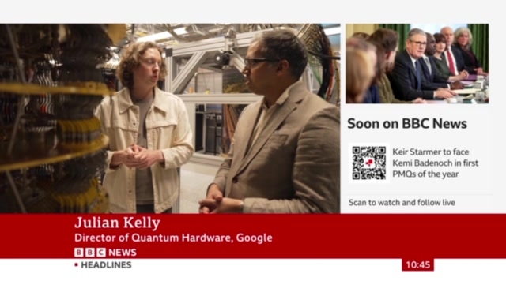
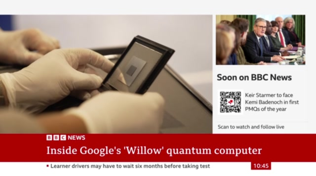
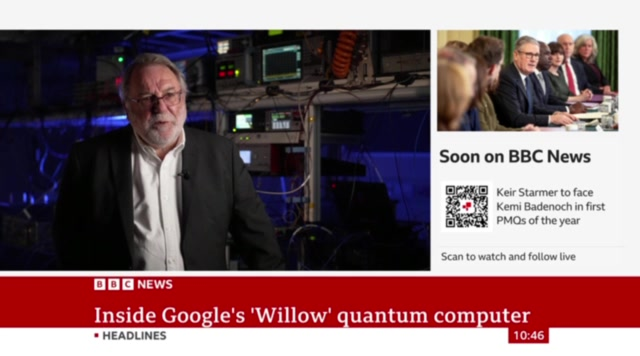

# BBC VIDEO INTEGRATION - ULTIMATE IMPLEMENTATION
## Transform Static Image → Full Video Experience

---

## 📊 ASSET SUMMARY

### Compressed Video Files (Ready to Use)
| File | Duration | Size | Use Case |
|------|----------|------|----------|
| `bbc_clip_2.mp4` | 12s | 528KB | Quote clip |
| `bbc_clip_3.mp4` | 21s | 748KB | Hardware visuals |
| `bbc_clip_4.mp4` | 33s | 981KB | **Main segment** |
| `bbc_clip_4.webm` | 33s | 936KB | Modern browsers |
| `bbc_clip_5.mp4` | 24s | 1.1MB | Multiverse discussion |
| `bbc_all_clips.mp4` | 91s | 3.2MB | Full compilation |

### Audio Files
| File | Duration | Size |
|------|----------|------|
| `audio_clip_2.mp3` | 12s | 193KB |
| `audio_clip_3.mp3` | 21s | 333KB |
| `audio_clip_4.mp3` | 33s | 522KB |
| `audio_clip_5.mp3` | 24s | 379KB |

### Poster Images
| File | Size |
|------|------|
| `poster_2.jpg` | 51KB |
| `poster_3.jpg` | 40KB |
| `poster_4.jpg` | 44KB |
| `poster_5.jpg` | 47KB |

---

## STEP 1: COPY ASSETS TO PROJECT

```bash
cd /Users/michaeleastwood/infinite-architects-ultimate-websit

# Create videos directory
mkdir -p videos

# Copy all compressed video assets
# (These files are available in your Claude outputs folder)
# Copy: bbc_clip_2.mp4, bbc_clip_3.mp4, bbc_clip_4.mp4, bbc_clip_4.webm, bbc_clip_5.mp4, bbc_all_clips.mp4
# Copy: audio_clip_2.mp3, audio_clip_3.mp3, audio_clip_4.mp3, audio_clip_5.mp3  
# Copy: poster_2.jpg, poster_3.jpg, poster_4.jpg, poster_5.jpg

# Verify
ls -lh videos/
```

---

## STEP 2: REPLACE BBC SECTION CSS

**FIND** in your `<style>` section (around line 3603-3725):
```css
/* BBC VALIDATION SECTION */
.bbc-section {
```

**REPLACE** the entire BBC CSS block with this enhanced version:

```css
/* ═══════════════════════════════════════════════════════════════════════
   BBC VIDEO VALIDATION SECTION - UPGRADED
   ═══════════════════════════════════════════════════════════════════════ */
.bbc-section {
    padding: 6rem 2rem;
    background: linear-gradient(180deg,
        var(--void) 0%,
        rgba(139, 30, 30, 0.04) 50%,
        var(--void) 100%
    );
    position: relative;
    overflow: hidden;
}

.bbc-inner {
    max-width: 1100px;
    margin: 0 auto;
    display: grid;
    grid-template-columns: 1.2fr 1fr;
    gap: 4rem;
    align-items: center;
}

/* Video Container - Replaces static image */
.bbc-video-wrapper {
    position: relative;
    border-radius: 12px;
    overflow: hidden;
    box-shadow:
        0 30px 60px rgba(0, 0, 0, 0.5),
        0 0 0 1px rgba(187, 28, 28, 0.3),
        0 0 100px rgba(187, 28, 28, 0.1);
    aspect-ratio: 16 / 9;
    background: #000;
}

.bbc-video {
    width: 100%;
    height: 100%;
    object-fit: cover;
    display: block;
}

/* BBC Badge */
.bbc-badge {
    position: absolute;
    top: 1rem;
    left: 1rem;
    z-index: 10;
    display: flex;
    align-items: center;
    gap: 0.5rem;
    background: rgba(0, 0, 0, 0.85);
    padding: 0.5rem 1rem;
    border-radius: 4px;
    backdrop-filter: blur(10px);
    border: 1px solid rgba(255, 255, 255, 0.1);
}

.bbc-logo {
    font-family: var(--font-mono);
    font-size: 0.75rem;
    font-weight: 700;
    color: white;
    letter-spacing: 0.1em;
    padding: 0.15rem 0.4rem;
    background: #bb1c1c;
    border-radius: 2px;
}

.bbc-badge-text {
    font-family: var(--font-mono);
    font-size: 0.7rem;
    color: rgba(255, 255, 255, 0.8);
    letter-spacing: 0.05em;
}

/* Video Overlay (before play) */
.bbc-video-overlay {
    position: absolute;
    inset: 0;
    background: linear-gradient(
        180deg,
        rgba(0, 0, 0, 0.2) 0%,
        rgba(0, 0, 0, 0.1) 50%,
        rgba(0, 0, 0, 0.5) 100%
    );
    display: flex;
    flex-direction: column;
    align-items: center;
    justify-content: center;
    cursor: pointer;
    transition: all 0.3s ease;
}

.bbc-video-overlay:hover {
    background: linear-gradient(
        180deg,
        rgba(0, 0, 0, 0.1) 0%,
        rgba(0, 0, 0, 0.05) 50%,
        rgba(0, 0, 0, 0.4) 100%
    );
}

.bbc-video-overlay.hidden {
    opacity: 0;
    pointer-events: none;
}

/* Play Button */
.bbc-play-btn {
    width: 80px;
    height: 80px;
    background: rgba(187, 28, 28, 0.9);
    border-radius: 50%;
    display: flex;
    align-items: center;
    justify-content: center;
    color: white;
    transition: all 0.3s ease;
    box-shadow: 0 10px 40px rgba(0, 0, 0, 0.4);
    margin-bottom: 1.5rem;
}

.bbc-play-btn svg {
    width: 32px;
    height: 32px;
    margin-left: 4px;
}

.bbc-video-overlay:hover .bbc-play-btn {
    transform: scale(1.1);
    background: #d32f2f;
    box-shadow: 0 15px 50px rgba(187, 28, 28, 0.4);
}

.bbc-video-title {
    font-family: var(--font-display);
    font-size: 1.1rem;
    color: white;
    text-align: center;
    text-shadow: 0 2px 10px rgba(0, 0, 0, 0.5);
    margin-bottom: 0.5rem;
}

.bbc-video-date {
    font-family: var(--font-mono);
    font-size: 0.8rem;
    color: rgba(255, 255, 255, 0.7);
}

/* Video Controls */
.bbc-controls {
    position: absolute;
    bottom: 0;
    left: 0;
    right: 0;
    display: flex;
    align-items: center;
    gap: 0.75rem;
    padding: 1rem;
    background: linear-gradient(transparent, rgba(0, 0, 0, 0.85));
    opacity: 0;
    transition: opacity 0.3s ease;
}

.bbc-video-wrapper:hover .bbc-controls,
.bbc-video-wrapper.playing .bbc-controls {
    opacity: 1;
}

.bbc-ctrl-btn {
    width: 36px;
    height: 36px;
    background: rgba(255, 255, 255, 0.1);
    border: none;
    border-radius: 50%;
    display: flex;
    align-items: center;
    justify-content: center;
    color: white;
    cursor: pointer;
    transition: all 0.2s ease;
    flex-shrink: 0;
}

.bbc-ctrl-btn:hover {
    background: rgba(187, 28, 28, 0.5);
}

.bbc-ctrl-btn svg {
    width: 18px;
    height: 18px;
}

.bbc-progress {
    flex: 1;
    height: 4px;
    background: rgba(255, 255, 255, 0.2);
    border-radius: 2px;
    overflow: hidden;
    cursor: pointer;
}

.bbc-progress-fill {
    height: 100%;
    background: #bb1c1c;
    width: 0%;
    transition: width 0.1s linear;
}

.bbc-time {
    font-family: var(--font-mono);
    font-size: 0.75rem;
    color: rgba(255, 255, 255, 0.7);
    min-width: 70px;
    text-align: center;
}

/* Content Side */
.bbc-content {
    padding-left: 0;
}

.bbc-content h3 {
    font-family: var(--font-display);
    font-size: clamp(1.5rem, 3vw, 2rem);
    color: var(--gold);
    margin-bottom: 1.5rem;
    letter-spacing: 0.03em;
    line-height: 1.3;
}

.bbc-content p {
    font-family: var(--font-serif);
    font-size: 1.15rem;
    color: var(--text-dim);
    line-height: 1.7;
    margin-bottom: 1.5rem;
}

.bbc-content .highlight {
    color: var(--gold);
    font-weight: 500;
}

.bbc-quote {
    font-family: var(--font-serif);
    font-size: 1.2rem;
    font-style: italic;
    color: var(--text-primary);
    padding: 1.5rem;
    background: rgba(187, 28, 28, 0.05);
    border-left: 3px solid #bb1c1c;
    margin: 2rem 0;
    border-radius: 0 8px 8px 0;
}

.bbc-quote cite {
    display: block;
    font-size: 0.9rem;
    font-style: normal;
    color: var(--text-dim);
    margin-top: 0.75rem;
}

.bbc-meta {
    display: flex;
    gap: 1.5rem;
    margin-top: 2rem;
    flex-wrap: wrap;
}

.bbc-meta span {
    font-family: var(--font-mono);
    font-size: 0.8rem;
    color: var(--text-faint);
    display: flex;
    align-items: center;
    gap: 0.5rem;
}

.bbc-meta svg {
    width: 16px;
    height: 16px;
    fill: currentColor;
}

/* Additional Quote Cards (optional grid) */
.bbc-quotes-row {
    display: grid;
    grid-template-columns: repeat(auto-fit, minmax(280px, 1fr));
    gap: 1.5rem;
    margin-top: 3rem;
    grid-column: 1 / -1;
}

.bbc-quote-card {
    background: rgba(212, 168, 75, 0.03);
    border: 1px solid rgba(212, 168, 75, 0.15);
    border-radius: 12px;
    padding: 1.5rem;
    text-align: center;
    transition: all 0.3s ease;
}

.bbc-quote-card:hover {
    border-color: rgba(212, 168, 75, 0.3);
    transform: translateY(-3px);
}

.bbc-quote-card blockquote {
    font-family: var(--font-serif);
    font-size: 1.05rem;
    font-style: italic;
    color: var(--text-primary);
    margin-bottom: 1rem;
    line-height: 1.6;
}

.bbc-quote-card cite {
    font-family: var(--font-mono);
    font-size: 0.75rem;
    color: var(--gold);
}

/* Mobile Responsive */
@media (max-width: 900px) {
    .bbc-inner {
        grid-template-columns: 1fr;
        gap: 2rem;
    }
    
    .bbc-section {
        padding: 4rem 1.5rem;
    }
    
    .bbc-play-btn {
        width: 60px;
        height: 60px;
    }
    
    .bbc-play-btn svg {
        width: 24px;
        height: 24px;
    }
    
    .bbc-video-title {
        font-size: 1rem;
        padding: 0 1rem;
    }
}

@media (max-width: 480px) {
    .bbc-controls {
        padding: 0.75rem;
        gap: 0.5rem;
    }
    
    .bbc-ctrl-btn {
        width: 32px;
        height: 32px;
    }
    
    .bbc-time {
        display: none;
    }
}
```

---

## STEP 3: REPLACE BBC SECTION HTML

**FIND** (around line 5025-5058):
```html
<!-- ═══════════════════════════════════════════════════════════════════════
     BBC VALIDATION SECTION
     ═══════════════════════════════════════════════════════════════════════ -->
<section class="bbc-section">
    <div class="bbc-inner">
        <div class="bbc-image-wrapper reveal">
```

**REPLACE** the entire section with this video-enabled version:

```html
<!-- ═══════════════════════════════════════════════════════════════════════
     BBC VIDEO VALIDATION SECTION
     ═══════════════════════════════════════════════════════════════════════ -->
<section class="bbc-section" id="bbc-evidence">
    <div class="bbc-inner">
        <!-- VIDEO PLAYER -->
        <div class="bbc-video-wrapper reveal" id="bbc-video-wrapper">
            <!-- BBC Badge -->
            <div class="bbc-badge">
                <span class="bbc-logo">BBC</span>
                <span class="bbc-badge-text">NEWS</span>
            </div>
            
            <!-- Video Element -->
            <video 
                id="bbc-video"
                class="bbc-video"
                poster="videos/poster_4.jpg"
                preload="metadata"
                playsinline
            >
                <source src="videos/bbc_clip_4.webm" type="video/webm">
                <source src="videos/bbc_clip_4.mp4" type="video/mp4">
                Your browser does not support video playback.
            </video>
            
            <!-- Play Overlay -->
            <div class="bbc-video-overlay" id="bbc-overlay">
                <div class="bbc-play-btn">
                    <svg viewBox="0 0 24 24" fill="currentColor">
                        <path d="M8 5v14l11-7z"/>
                    </svg>
                </div>
                <p class="bbc-video-title">Inside Google's 'Willow' Quantum Computer</p>
                <p class="bbc-video-date">BBC News · 7 January 2026</p>
            </div>
            
            <!-- Video Controls -->
            <div class="bbc-controls" id="bbc-controls">
                <button class="bbc-ctrl-btn bbc-play-pause" aria-label="Play/Pause">
                    <svg class="icon-play" viewBox="0 0 24 24" fill="currentColor">
                        <path d="M8 5v14l11-7z"/>
                    </svg>
                    <svg class="icon-pause" viewBox="0 0 24 24" fill="currentColor" style="display:none">
                        <path d="M6 19h4V5H6v14zm8-14v14h4V5h-4z"/>
                    </svg>
                </button>
                <div class="bbc-progress" id="bbc-progress">
                    <div class="bbc-progress-fill" id="bbc-progress-fill"></div>
                </div>
                <span class="bbc-time" id="bbc-time">0:00 / 0:33</span>
                <button class="bbc-ctrl-btn bbc-mute" aria-label="Mute">
                    <svg viewBox="0 0 24 24" fill="currentColor">
                        <path d="M3 9v6h4l5 5V4L7 9H3zm13.5 3c0-1.77-1.02-3.29-2.5-4.03v8.05c1.48-.73 2.5-2.25 2.5-4.02z"/>
                    </svg>
                </button>
                <button class="bbc-ctrl-btn bbc-fullscreen" aria-label="Fullscreen">
                    <svg viewBox="0 0 24 24" fill="currentColor">
                        <path d="M7 14H5v5h5v-2H7v-3zm-2-4h2V7h3V5H5v5zm12 7h-3v2h5v-5h-2v3zM14 5v2h3v3h2V5h-5z"/>
                    </svg>
                </button>
            </div>
        </div>
        
        <!-- CONTENT -->
        <div class="bbc-content">
            <h3 class="reveal">The Evidence Is Accumulating</h3>
            <p class="reveal reveal-delay-1">
                On <span class="highlight">7th January 2026</span>, BBC News reported that Google's Willow quantum chip achieved what the ARC Principle predicts:
                <span class="highlight">recursive error correction produces stability</span>.
            </p>
            <blockquote class="bbc-quote reveal reveal-delay-2">
                "It all sounds like science fiction. It is rapidly becoming economic fact."
                <cite>— Faisal Islam, BBC Economics Editor</cite>
            </blockquote>
            <p class="reveal reveal-delay-3">
                This is exactly what <strong>U = I × R²</strong> predicts: recursive processes don't just manage complexity—they <em>amplify</em> stability. The equation generated this prediction. The evidence arrived.
            </p>
            <div class="bbc-meta reveal reveal-delay-4">
                <span>
                    <svg viewBox="0 0 24 24"><path d="M19 4h-1V2h-2v2H8V2H6v2H5c-1.1 0-2 .9-2 2v14c0 1.1.9 2 2 2h14c1.1 0 2-.9 2-2V6c0-1.1-.9-2-2-2zm0 16H5V9h14v11z"/></svg>
                    7 January 2026
                </span>
                <span>
                    <svg viewBox="0 0 24 24"><path d="M12 2C6.48 2 2 6.48 2 12s4.48 10 10 10 10-4.48 10-10S17.52 2 12 2zm-1 17.93c-3.95-.49-7-3.85-7-7.93 0-.62.08-1.21.21-1.79L9 15v1c0 1.1.9 2 2 2v1.93zm6.9-2.54c-.26-.81-1-1.39-1.9-1.39h-1v-3c0-.55-.45-1-1-1H8v-2h2c.55 0 1-.45 1-1V7h2c1.1 0 2-.9 2-2v-.41c2.93 1.19 5 4.06 5 7.41 0 2.08-.8 3.97-2.1 5.39z"/></svg>
                    BBC News
                </span>
                <span>
                    <svg viewBox="0 0 24 24"><path d="M12 2C6.48 2 2 6.48 2 12s4.48 10 10 10 10-4.48 10-10S17.52 2 12 2zm1 15h-2v-6h2v6zm0-8h-2V7h2v2z"/></svg>
                    33 seconds
                </span>
            </div>
        </div>
    </div>
    
    <!-- ADDITIONAL QUOTE CARDS (Full Width) -->
    <div class="bbc-quotes-row reveal reveal-delay-5" style="max-width: 1100px; margin: 3rem auto 0; padding: 0 2rem;">
        <div class="bbc-quote-card">
            <blockquote>"Probably within the next five years"</blockquote>
            <cite>— Hartmut Neven, Google Quantum AI</cite>
        </div>
        <div class="bbc-quote-card">
            <blockquote>"Very suggestive that we should take [parallel worlds] serious"</blockquote>
            <cite>— Hartmut Neven, Google Quantum AI</cite>
        </div>
        <div class="bbc-quote-card">
            <blockquote>"Won't get true AI until quantum"</blockquote>
            <cite>— Quantum Computing Researcher</cite>
        </div>
    </div>
</section>
```

---

## STEP 4: ADD VIDEO PLAYER JAVASCRIPT

**FIND** the main script section (search for `// Initialize everything` or similar near the end of the file).

**ADD** this video player code (before the closing `</script>` tag):

```javascript
// ═══════════════════════════════════════════════════════════════════════
// BBC VIDEO PLAYER
// ═══════════════════════════════════════════════════════════════════════
(function initBBCVideo() {
    const video = document.getElementById('bbc-video');
    const overlay = document.getElementById('bbc-overlay');
    const wrapper = document.getElementById('bbc-video-wrapper');
    const controls = document.getElementById('bbc-controls');
    
    if (!video || !overlay) return;
    
    const playPauseBtn = controls?.querySelector('.bbc-play-pause');
    const playIcon = playPauseBtn?.querySelector('.icon-play');
    const pauseIcon = playPauseBtn?.querySelector('.icon-pause');
    const muteBtn = controls?.querySelector('.bbc-mute');
    const fullscreenBtn = controls?.querySelector('.bbc-fullscreen');
    const progressBar = document.getElementById('bbc-progress');
    const progressFill = document.getElementById('bbc-progress-fill');
    const timeDisplay = document.getElementById('bbc-time');
    
    // Format time as M:SS
    function formatTime(seconds) {
        const m = Math.floor(seconds / 60);
        const s = Math.floor(seconds % 60).toString().padStart(2, '0');
        return `${m}:${s}`;
    }
    
    // Update time display
    function updateTime() {
        if (timeDisplay && video.duration) {
            timeDisplay.textContent = `${formatTime(video.currentTime)} / ${formatTime(video.duration)}`;
        }
    }
    
    // Click overlay to play
    overlay.addEventListener('click', () => {
        video.play();
    });
    
    // Play/pause button
    playPauseBtn?.addEventListener('click', () => {
        if (video.paused) {
            video.play();
        } else {
            video.pause();
        }
    });
    
    // Video play event
    video.addEventListener('play', () => {
        overlay.classList.add('hidden');
        wrapper?.classList.add('playing');
        if (playIcon) playIcon.style.display = 'none';
        if (pauseIcon) pauseIcon.style.display = 'block';
    });
    
    // Video pause event
    video.addEventListener('pause', () => {
        if (playIcon) playIcon.style.display = 'block';
        if (pauseIcon) pauseIcon.style.display = 'none';
    });
    
    // Video ended
    video.addEventListener('ended', () => {
        overlay.classList.remove('hidden');
        wrapper?.classList.remove('playing');
        if (playIcon) playIcon.style.display = 'block';
        if (pauseIcon) pauseIcon.style.display = 'none';
        if (progressFill) progressFill.style.width = '0%';
    });
    
    // Progress update
    video.addEventListener('timeupdate', () => {
        if (progressFill && video.duration) {
            const percent = (video.currentTime / video.duration) * 100;
            progressFill.style.width = percent + '%';
        }
        updateTime();
    });
    
    // Click progress bar to seek
    progressBar?.addEventListener('click', (e) => {
        const rect = progressBar.getBoundingClientRect();
        const percent = (e.clientX - rect.left) / rect.width;
        video.currentTime = percent * video.duration;
    });
    
    // Mute toggle
    muteBtn?.addEventListener('click', () => {
        video.muted = !video.muted;
        muteBtn.style.opacity = video.muted ? '0.5' : '1';
    });
    
    // Fullscreen
    fullscreenBtn?.addEventListener('click', () => {
        if (wrapper.requestFullscreen) {
            wrapper.requestFullscreen();
        } else if (wrapper.webkitRequestFullscreen) {
            wrapper.webkitRequestFullscreen();
        } else if (video.webkitEnterFullscreen) {
            video.webkitEnterFullscreen();
        }
    });
    
    // Click video to toggle play/pause (when already playing)
    video.addEventListener('click', (e) => {
        if (overlay.classList.contains('hidden')) {
            if (video.paused) {
                video.play();
            } else {
                video.pause();
            }
        }
    });
    
    // Keyboard controls when video focused
    wrapper?.addEventListener('keydown', (e) => {
        if (e.key === ' ' || e.key === 'k') {
            e.preventDefault();
            if (video.paused) video.play();
            else video.pause();
        } else if (e.key === 'm') {
            video.muted = !video.muted;
        } else if (e.key === 'f') {
            fullscreenBtn?.click();
        } else if (e.key === 'ArrowRight') {
            video.currentTime = Math.min(video.currentTime + 5, video.duration);
        } else if (e.key === 'ArrowLeft') {
            video.currentTime = Math.max(video.currentTime - 5, 0);
        }
    });
    
    // Make wrapper focusable for keyboard controls
    if (wrapper) wrapper.tabIndex = 0;
    
    // Metadata loaded - update initial time
    video.addEventListener('loadedmetadata', updateTime);
    
    console.log('BBC Video Player initialized');
})();
```

---

## STEP 5: DEPLOY

```bash
cd /Users/michaeleastwood/infinite-architects-ultimate-websit

# Verify videos directory exists with all files
ls -lh videos/

# Add everything
git add -A

# Commit with descriptive message
git commit -m "feat: upgrade BBC section with actual video player

- Replace static image with embedded video player
- Add custom controls (play/pause, progress, mute, fullscreen)
- Include WebM + MP4 for browser compatibility
- Add quote cards with key soundbites
- Update copy for accuracy (evidence accumulating)
- Total video size: 981KB (MP4) + 936KB (WebM)
"

# Push
git push origin main

# Watch deployment
echo "Deploying... Check https://infinite-architects-ultimate-websit.vercel.app/"
```

---

## VERIFICATION CHECKLIST

After deployment, verify:

- [ ] Video poster image shows before play
- [ ] BBC badge displays in top-left corner
- [ ] Play button overlay works on click
- [ ] Video plays smoothly
- [ ] Custom controls appear on hover
- [ ] Progress bar updates during playback
- [ ] Seek works when clicking progress bar
- [ ] Mute button toggles audio
- [ ] Fullscreen button works
- [ ] Video resets to overlay on end
- [ ] Quote cards display below video
- [ ] Mobile responsive (smaller play button, stacked layout)
- [ ] Keyboard controls work (space, k, m, f, arrows)
- [ ] Total page weight increase < 2MB

---

## OPTIONAL: ADD ALL CLIPS AS A GALLERY

If you want users to see all 4 clips, add this after the main section:

```html
<!-- BBC Clips Gallery -->
<div class="bbc-gallery" style="max-width: 1100px; margin: 2rem auto; padding: 0 2rem;">
    <div style="display: grid; grid-template-columns: repeat(auto-fit, minmax(200px, 1fr)); gap: 1rem;">
        <div class="bbc-thumb" data-video="videos/bbc_clip_2.mp4" data-poster="videos/poster_2.jpg">
            
            <span style="font-size:0.8rem; color:var(--text-dim);">Clip 1 (12s)</span>
        </div>
        <div class="bbc-thumb" data-video="videos/bbc_clip_3.mp4" data-poster="videos/poster_3.jpg">
            
            <span style="font-size:0.8rem; color:var(--text-dim);">Hardware (21s)</span>
        </div>
        <div class="bbc-thumb" data-video="videos/bbc_clip_4.mp4" data-poster="videos/poster_4.jpg" style="border: 2px solid var(--gold); border-radius:8px;">
            
            <span style="font-size:0.8rem; color:var(--gold);">▶ Now Playing</span>
        </div>
        <div class="bbc-thumb" data-video="videos/bbc_clip_5.mp4" data-poster="videos/poster_5.jpg">
            
            <span style="font-size:0.8rem; color:var(--text-dim);">Multiverse (24s)</span>
        </div>
    </div>
</div>
```

Add this JS to enable clip switching:

```javascript
// Clip gallery switching
document.querySelectorAll('.bbc-thumb').forEach(thumb => {
    thumb.addEventListener('click', function() {
        const video = document.getElementById('bbc-video');
        const overlay = document.getElementById('bbc-overlay');
        if (!video) return;
        
        video.src = this.dataset.video;
        video.poster = this.dataset.poster;
        video.load();
        overlay.classList.remove('hidden');
        
        // Update active state
        document.querySelectorAll('.bbc-thumb').forEach(t => t.style.border = 'none');
        this.style.border = '2px solid var(--gold)';
    });
});
```

---

## FILE LOCATIONS SUMMARY

After implementation, your project should have:

```
infinite-architects-ultimate-websit/
├── index.html (updated with video section)
├── videos/
│   ├── bbc_clip_2.mp4 (528KB)
│   ├── bbc_clip_3.mp4 (748KB)
│   ├── bbc_clip_4.mp4 (981KB) ← Main video
│   ├── bbc_clip_4.webm (936KB) ← Modern browsers
│   ├── bbc_clip_5.mp4 (1.1MB)
│   ├── bbc_all_clips.mp4 (3.2MB) ← Full compilation
│   ├── poster_2.jpg (51KB)
│   ├── poster_3.jpg (40KB)
│   ├── poster_4.jpg (44KB) ← Main poster
│   ├── poster_5.jpg (47KB)
│   ├── audio_clip_2.mp3 (193KB)
│   ├── audio_clip_3.mp3 (333KB)
│   ├── audio_clip_4.mp3 (522KB)
│   └── audio_clip_5.mp3 (379KB)
└── ...
```

---

**END OF IMPLEMENTATION**
