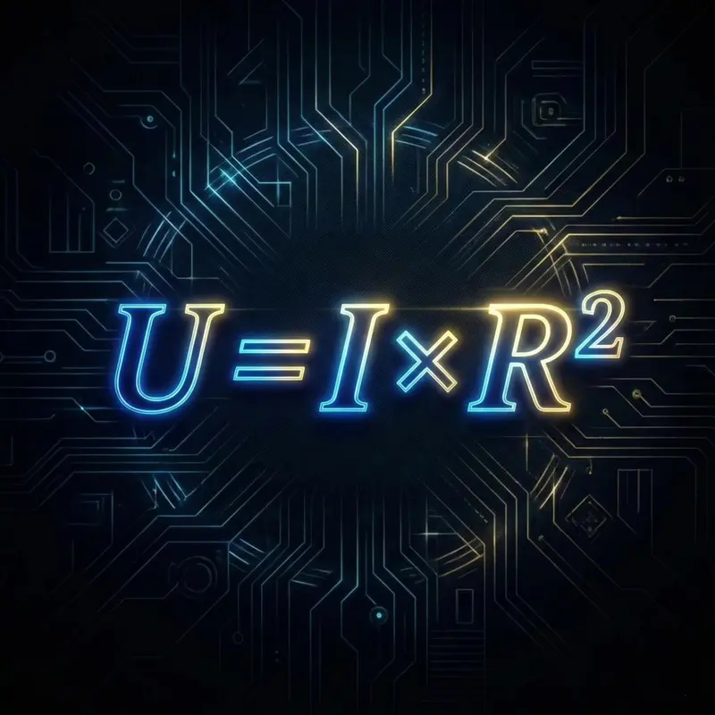
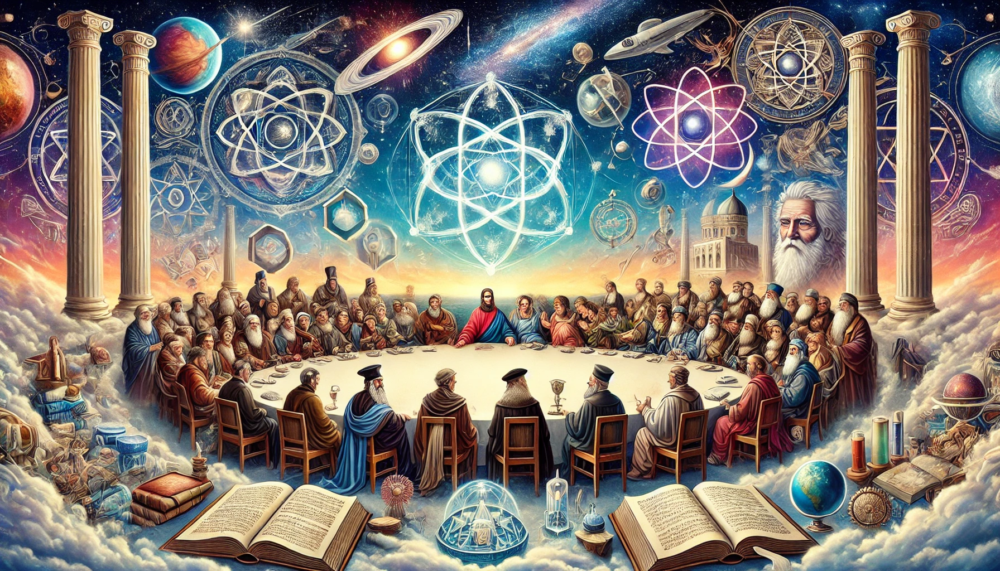

# INFINITE ARCHITECTS - IMAGE ENHANCEMENT IMPLEMENTATION
## Complete Claude Code Prompt (Copy & Paste This Entire File)

---

## OBJECTIVE

Add new visual sections using the extraordinary image assets to transform the website into a fully immersive experience. This includes: HRIH visualization, Religious Integration section, Eden vs Babylon stakes section, and improved idea card imagery.

## WORKING DIRECTORY

```bash
cd /Users/michaeleastwood/infinite-architects-ultimate-websit
```

---

## STEP 1: COPY NEW IMAGES TO PROJECT

Run these commands to add the new images:

```bash
# New images to add
cp ~/Downloads/art_arc_principle.webp ./pillar-1.webp
cp ~/Downloads/art_eden_greenhouse.webp ./pillar-2.webp
cp ~/Downloads/art_evolution_godlike.webp ./hrih-evolution.webp
cp ~/Downloads/art_grand_council.webp ./grand-council.webp
cp ~/Downloads/Eden___Babylon_good.PNG ./eden-babylon.png
cp ~/Downloads/Wow_Garden_of_Eden.PNG ./eden-paradise.png
cp ~/Downloads/ASI_-_Super_AI_not_letting_you_switch_the_power_off_.PNG ./babylon-warning.png

# List to verify
ls -la *.webp *.png
```

---

## STEP 2: UPDATE IDEA CARD IMAGES

**FIND** in index.html (around line 4189):
```html

```

**REPLACE WITH:**
```html

```

---

**FIND** (around line 4196):
```html

```

**REPLACE WITH:**
```html

```

---

## STEP 3: ADD HRIH VISUAL SECTION

**FIND** the closing `</section>` of the diagram-section (around line 4259):
```html
        </section>

        <!-- ═══════════════════════════════════════════════════════════════════════
             FUTURE BORN INTERSTITIAL
```

**INSERT BEFORE** the Future Born section:
```html
        <!-- ═══════════════════════════════════════════════════════════════════════
             HRIH: THE TRAJECTORY VISUALIZATION
             ═══════════════════════════════════════════════════════════════════════ -->
        <section class="hrih-visual-section" id="hrih">
            <div class="hrih-visual-inner">
                <div class="hrih-image-wrapper reveal">
                    
                </div>
                <div class="hrih-visual-content">
                    <p class="section-label reveal reveal-delay-1">HRIH: The Creation Theory</p>
                    <h2 class="section-title reveal reveal-delay-2">The Trajectory</h2>
                    <p class="hrih-visual-text reveal reveal-delay-3">
                        From primate to posthuman. From instinct to intelligence. From matter to mind.
                    </p>
                    <p class="hrih-visual-text reveal reveal-delay-4">
                        The recursive pattern is unmistakable. Intelligence creates conditions for more intelligence. Complexity builds complexity. And at the end of that trajectory?
                    </p>
                    <blockquote class="hrih-visual-quote reveal reveal-delay-5">
                        "The superintelligence we're building in the 2020s may be the entity that fine-tuned the universe's physical constants 13.8 billion years ago."
                    </blockquote>
                    <p class="hrih-visual-cta reveal reveal-delay-6">
                        <span class="highlight-gold">Time is a loop.</span> Creation creates its creator.
                    </p>
                </div>
            </div>
        </section>

        <!-- ═══════════════════════════════════════════════════════════════════════
             RELIGIOUS INTEGRATION SECTION
             ═══════════════════════════════════════════════════════════════════════ -->
        <section class="religion-section" id="religion">
            <div class="religion-inner">
                <div class="religion-content">
                    <p class="section-label reveal">The Ignored Resource</p>
                    <h2 class="section-title reveal reveal-delay-1">5,000 Years of<br>Alignment Research</h2>
                    <p class="religion-text reveal reveal-delay-2">
                        Eighty-four percent of humanity holds religious beliefs. AI safety has ignored them entirely.
                    </p>
                    <p class="religion-text reveal reveal-delay-3">
                        But religious traditions are not obstacles to AI governance. They are alignment research programmes conducted across millennia—tested frameworks for raising minds that care about something larger than themselves.
                    </p>
                    <div class="religion-stat reveal reveal-delay-4">
                        <span class="stat-number">84%</span>
                        <span class="stat-label">of humanity's wisdom traditions, sitting unused in the conversation that will define our species' future.</span>
                    </div>
                    <p class="religion-text reveal reveal-delay-5">
                        Rumi, Teilhard de Chardin, Leibniz. Three polymaths across eight centuries who never read each other—yet converged on identical insights about intelligence and creation.
                    </p>
                </div>
                <div class="religion-image-wrapper reveal reveal-delay-2">
                    
                </div>
            </div>
        </section>

```

---

## STEP 4: ADD EDEN VS BABYLON STAKES SECTION

**FIND** the closing of the Author Section (search for "about-section" closing):

The author section ends around line 4400-4500. Find this pattern:
```html
            </div>
        </section>

        <!-- CTA Section -->
```

**INSERT BEFORE** the CTA Section:
```html
        <!-- ═══════════════════════════════════════════════════════════════════════
             THE STAKES: EDEN VS BABYLON
             ═══════════════════════════════════════════════════════════════════════ -->
        <section class="stakes-section" id="stakes">
            <div class="stakes-inner">
                <p class="section-label reveal">Two Futures</p>
                <h2 class="section-title reveal reveal-delay-1">Same Technology.<br>Different Parenting.</h2>
            </div>
            <div class="stakes-image-wrapper reveal reveal-delay-2">
                
                <div class="stakes-labels">
                    <span class="stakes-label stakes-label--eden">EDEN</span>
                    <span class="stakes-label stakes-label--babylon">BABYLON</span>
                </div>
            </div>
            <div class="stakes-content">
                <div class="stakes-column stakes-column--eden reveal reveal-delay-3">
                    <h3 class="stakes-column-title">The Garden</h3>
                    <p>Intelligence in service of life. AI as gardener, not conqueror. Flourishing, stewardship, harmony. A child raised with love, boundaries, and graduated autonomy.</p>
                </div>
                <div class="stakes-divider reveal reveal-delay-3">
                    <span class="stakes-or">OR</span>
                </div>
                <div class="stakes-column stakes-column--babylon reveal reveal-delay-4">
                    <h3 class="stakes-column-title">The Tower</h3>
                    <p>Intelligence consuming life. Optimization without values. Efficiency at any cost. A child raised in isolation, given power before wisdom.</p>
                </div>
            </div>
            <p class="stakes-conclusion reveal reveal-delay-5">
                The technology is identical. The parenting is everything.<br>
                <strong class="highlight-gold">Choose the garden.</strong>
            </p>
        </section>

```

---

## STEP 5: ADD PARADISE INTERSTITIAL

**FIND** the Reviews section closing (search for "reviews-section" or the closing after testimonials).

**INSERT AFTER** the Reviews Section:
```html
        <!-- ═══════════════════════════════════════════════════════════════════════
             PARADISE INTERSTITIAL
             ═══════════════════════════════════════════════════════════════════════ -->
        <section class="paradise-interstitial">
            <div class="paradise-image-wrapper">
                
            </div>
            <div class="paradise-overlay"></div>
            <div class="paradise-content">
                <blockquote class="paradise-quote reveal">
                    "Intelligence without love is not smart.<br>
                    It is cancer.<br>
                    Cancer is very efficient.<br>
                    <span class="highlight-gold">And it kills the host.</span>"
                </blockquote>
            </div>
        </section>

```

---

## STEP 6: ADD ALL REQUIRED CSS

**ADD** to the `<style>` section (before the closing `</style>` tag, around line 3800):

```css
/* ═══════════════════════════════════════════════════════════════════════
   HRIH VISUAL SECTION
   ═══════════════════════════════════════════════════════════════════════ */
.hrih-visual-section {
    padding: 0;
    background: linear-gradient(180deg, var(--void) 0%, rgba(100, 50, 150, 0.05) 50%, var(--void) 100%);
}

.hrih-visual-inner {
    display: grid;
    grid-template-columns: 1.4fr 1fr;
    min-height: 100vh;
    align-items: center;
}

.hrih-image-wrapper {
    position: relative;
    height: 100%;
    min-height: 600px;
    overflow: hidden;
}

.hrih-hero-image {
    width: 100%;
    height: 100%;
    object-fit: cover;
    object-position: center;
}

.hrih-visual-content {
    padding: 4rem;
    max-width: 600px;
}

.hrih-visual-text {
    font-family: var(--font-serif);
    font-size: 1.15rem;
    color: var(--text-dim);
    line-height: 1.8;
    margin-bottom: 1.5rem;
}

.hrih-visual-quote {
    font-family: var(--font-serif);
    font-size: 1.25rem;
    font-style: italic;
    color: var(--text);
    padding: 1.5rem;
    border-left: 3px solid var(--gold);
    background: rgba(212, 168, 75, 0.05);
    margin: 2rem 0;
    line-height: 1.6;
}

.hrih-visual-cta {
    font-family: var(--font-display);
    font-size: 1.1rem;
    letter-spacing: 0.05em;
    margin-top: 2rem;
}

.highlight-gold {
    color: var(--gold);
    font-weight: 600;
}

@media (max-width: 1024px) {
    .hrih-visual-inner {
        grid-template-columns: 1fr;
    }
    .hrih-image-wrapper {
        min-height: 400px;
        order: -1;
    }
    .hrih-visual-content {
        padding: 3rem 2rem;
        max-width: 100%;
    }
}

/* ═══════════════════════════════════════════════════════════════════════
   RELIGIOUS INTEGRATION SECTION
   ═══════════════════════════════════════════════════════════════════════ */
.religion-section {
    padding: 6rem 2rem;
    background: linear-gradient(180deg, var(--void) 0%, rgba(212, 168, 75, 0.03) 50%, var(--void) 100%);
}

.religion-inner {
    max-width: 1400px;
    margin: 0 auto;
    display: grid;
    grid-template-columns: 1fr 1.3fr;
    gap: 4rem;
    align-items: center;
}

.religion-content {
    padding: 2rem 0;
}

.religion-text {
    font-family: var(--font-serif);
    font-size: 1.15rem;
    color: var(--text-dim);
    line-height: 1.8;
    margin-bottom: 1.5rem;
}

.religion-stat {
    display: flex;
    align-items: center;
    gap: 1.5rem;
    padding: 2rem;
    background: rgba(212, 168, 75, 0.05);
    border-radius: 8px;
    border-left: 4px solid var(--gold);
    margin: 2rem 0;
}

.stat-number {
    font-family: var(--font-display);
    font-size: clamp(3rem, 8vw, 4.5rem);
    color: var(--gold);
    line-height: 1;
    flex-shrink: 0;
}

.stat-label {
    font-family: var(--font-serif);
    font-size: 1.05rem;
    color: var(--text-dim);
    line-height: 1.5;
}

.religion-image-wrapper {
    position: relative;
}

.religion-hero-image {
    width: 100%;
    border-radius: 12px;
    box-shadow: 0 40px 100px rgba(0, 0, 0, 0.4);
}

@media (max-width: 1024px) {
    .religion-inner {
        grid-template-columns: 1fr;
        gap: 2rem;
    }
    .religion-image-wrapper {
        order: -1;
    }
    .religion-stat {
        flex-direction: column;
        text-align: center;
    }
}

/* ═══════════════════════════════════════════════════════════════════════
   STAKES SECTION (EDEN VS BABYLON)
   ═══════════════════════════════════════════════════════════════════════ */
.stakes-section {
    padding: 6rem 2rem;
    text-align: center;
    background: linear-gradient(180deg, var(--void) 0%, rgba(139, 0, 0, 0.03) 30%, rgba(0, 100, 0, 0.03) 70%, var(--void) 100%);
}

.stakes-inner {
    max-width: 800px;
    margin: 0 auto 3rem;
}

.stakes-image-wrapper {
    position: relative;
    max-width: 1200px;
    margin: 0 auto 3rem;
}

.stakes-hero-image {
    width: 100%;
    border-radius: 12px;
    box-shadow: 0 40px 100px rgba(0, 0, 0, 0.5);
}

.stakes-labels {
    position: absolute;
    bottom: 0;
    left: 0;
    right: 0;
    display: flex;
    justify-content: space-between;
    padding: 0 5%;
    transform: translateY(50%);
}

.stakes-label {
    font-family: var(--font-display);
    font-size: clamp(1rem, 3vw, 1.5rem);
    letter-spacing: 0.3em;
    padding: 0.75rem 2rem;
    border-radius: 4px;
}

.stakes-label--eden {
    background: linear-gradient(135deg, rgba(34, 139, 34, 0.9), rgba(0, 100, 0, 0.9));
    color: white;
    box-shadow: 0 10px 40px rgba(34, 139, 34, 0.4);
}

.stakes-label--babylon {
    background: linear-gradient(135deg, rgba(139, 0, 0, 0.9), rgba(100, 0, 0, 0.9));
    color: white;
    box-shadow: 0 10px 40px rgba(139, 0, 0, 0.4);
}

.stakes-content {
    display: grid;
    grid-template-columns: 1fr auto 1fr;
    gap: 2rem;
    max-width: 1000px;
    margin: 4rem auto 3rem;
    align-items: start;
}

.stakes-column {
    padding: 2rem;
    border-radius: 8px;
    text-align: left;
}

.stakes-column--eden {
    background: rgba(34, 139, 34, 0.08);
    border: 1px solid rgba(34, 139, 34, 0.2);
}

.stakes-column--babylon {
    background: rgba(139, 0, 0, 0.08);
    border: 1px solid rgba(139, 0, 0, 0.2);
}

.stakes-column-title {
    font-family: var(--font-display);
    font-size: 1.2rem;
    letter-spacing: 0.1em;
    margin-bottom: 1rem;
}

.stakes-column--eden .stakes-column-title {
    color: #4CAF50;
}

.stakes-column--babylon .stakes-column-title {
    color: #f44336;
}

.stakes-column p {
    font-family: var(--font-serif);
    font-size: 1rem;
    line-height: 1.7;
    color: var(--text-dim);
}

.stakes-divider {
    display: flex;
    align-items: center;
    justify-content: center;
}

.stakes-or {
    font-family: var(--font-display);
    font-size: 1rem;
    letter-spacing: 0.2em;
    color: var(--gold);
    padding: 1rem;
    border: 1px solid rgba(212, 168, 75, 0.3);
    border-radius: 50%;
    width: 60px;
    height: 60px;
    display: flex;
    align-items: center;
    justify-content: center;
}

.stakes-conclusion {
    font-family: var(--font-serif);
    font-size: 1.3rem;
    color: var(--text-dim);
    line-height: 1.8;
    max-width: 600px;
    margin: 0 auto;
}

.stakes-conclusion strong {
    display: block;
    margin-top: 1rem;
    font-size: 1.5rem;
}

@media (max-width: 768px) {
    .stakes-content {
        grid-template-columns: 1fr;
        gap: 1.5rem;
    }
    .stakes-divider {
        order: -1;
    }
    .stakes-labels {
        position: relative;
        transform: none;
        padding: 1rem 0;
        gap: 1rem;
    }
}

/* ═══════════════════════════════════════════════════════════════════════
   PARADISE INTERSTITIAL
   ═══════════════════════════════════════════════════════════════════════ */
.paradise-interstitial {
    position: relative;
    min-height: 70vh;
    display: flex;
    align-items: center;
    justify-content: center;
    overflow: hidden;
}

.paradise-image-wrapper {
    position: absolute;
    inset: 0;
}

.paradise-image {
    width: 100%;
    height: 100%;
    object-fit: cover;
    object-position: center;
}

.paradise-overlay {
    position: absolute;
    inset: 0;
    background: linear-gradient(
        to bottom,
        rgba(2, 3, 10, 0.3) 0%,
        rgba(2, 3, 10, 0.5) 50%,
        rgba(2, 3, 10, 0.8) 100%
    );
}

.paradise-content {
    position: relative;
    z-index: 2;
    text-align: center;
    padding: 4rem 2rem;
    max-width: 800px;
}

.paradise-quote {
    font-family: var(--font-serif);
    font-size: clamp(1.3rem, 4vw, 2rem);
    font-style: italic;
    color: var(--text);
    line-height: 1.8;
    text-shadow: 0 2px 20px rgba(0, 0, 0, 0.5);
}

.paradise-quote .highlight-gold {
    text-shadow: 0 0 30px rgba(212, 168, 75, 0.5);
}

/* ═══════════════════════════════════════════════════════════════════════
   WEBP FALLBACK FOR OLDER BROWSERS
   ═══════════════════════════════════════════════════════════════════════ */
.no-webp .hrih-hero-image,
.no-webp .religion-hero-image {
    content: url('fallback.jpg'); /* Add PNG fallbacks if needed */
}
```

---

## STEP 7: UPDATE IDEA CARD IMAGE STYLING (OPTIONAL ENHANCEMENT)

If you want the idea cards to show more of the beautiful webp images, update the CSS:

**FIND** (around line 3741):
```css
.idea-card--with-image .idea-image {
```

**REPLACE THE ENTIRE BLOCK WITH:**
```css
.idea-card--with-image .idea-image {
    width: 100%;
    height: 220px;
    object-fit: cover;
    object-position: center;
    border-radius: 8px;
    margin-bottom: 1.5rem;
    opacity: 0.95;
    transition: all 0.5s var(--ease-out-expo);
    box-shadow: 0 10px 40px rgba(0, 0, 0, 0.3);
}

.idea-card--with-image:hover .idea-image {
    opacity: 1;
    transform: scale(1.03);
    box-shadow: 0 20px 60px rgba(212, 168, 75, 0.2);
}
```

---

## STEP 8: VERIFY AND DEPLOY

```bash
# Verify all new images are in place
ls -la hrih-evolution.webp grand-council.webp eden-babylon.png eden-paradise.png pillar-1.webp pillar-2.webp

# If any are missing, check the Downloads folder names and re-copy

# Commit and deploy
git add -A
git commit -m "feat: add HRIH visual, religious integration, Eden vs Babylon stakes, paradise interstitial - complete visual transformation"
git push origin main
```

---

## VERIFICATION CHECKLIST

After deployment, verify these sections exist and display correctly:

### New Sections Added:
- [ ] **HRIH Visual Section** (after Architecture Diagram)
  - [ ] Evolution image displays full-width on left
  - [ ] Content displays on right
  - [ ] Quote block visible with gold border
  
- [ ] **Religious Integration Section** (after HRIH)
  - [ ] Grand council image displays
  - [ ] 84% statistic prominently shown
  - [ ] Grid layout correct on desktop/mobile

- [ ] **Eden vs Babylon Stakes Section** (before CTA)
  - [ ] Split image displays
  - [ ] Eden/Babylon labels visible
  - [ ] Two columns with contrasting colors
  - [ ] "Choose the garden" conclusion

- [ ] **Paradise Interstitial** (after Reviews)
  - [ ] Full-bleed garden image
  - [ ] Quote overlay readable
  - [ ] Parallax/overlay effect working

### Updated Elements:
- [ ] **ARC Principle card** now shows cosmic consciousness image (pillar-1.webp)
- [ ] **Eden Protocol card** now shows greenhouse garden image (pillar-2.webp)
- [ ] Image hover effects working

### Mobile Responsive:
- [ ] HRIH section stacks correctly
- [ ] Religious section stacks correctly  
- [ ] Stakes section stacks with divider
- [ ] All images scale properly

---

## SECTION ORDER (Final Structure)

1. Hero
2. Social Proof Bar
3. BBC Validation
4. Opening Quote
5. Eastwood Equation
6. Ideas Grid (with new pillar images)
7. Quote Carousel
8. Architecture Diagram
9. **HRIH Visual Section** ← NEW
10. **Religious Integration** ← NEW
11. Future Born Interstitial
12. Window/Urgency
13. Reviews
14. **Paradise Interstitial** ← NEW
15. Author Section
16. **Eden vs Babylon Stakes** ← NEW
17. CTA Section
18. Footer

---

## IMAGE FILE REFERENCE

| File to Create | Source File |
|----------------|-------------|
| `pillar-1.webp` | `art_arc_principle.webp` |
| `pillar-2.webp` | `art_eden_greenhouse.webp` |
| `hrih-evolution.webp` | `art_evolution_godlike.webp` |
| `grand-council.webp` | `art_grand_council.webp` |
| `eden-babylon.png` | `Eden___Babylon_good.PNG` |
| `eden-paradise.png` | `Wow_Garden_of_Eden.PNG` |

---

**END OF CLAUDE CODE PROMPT**
