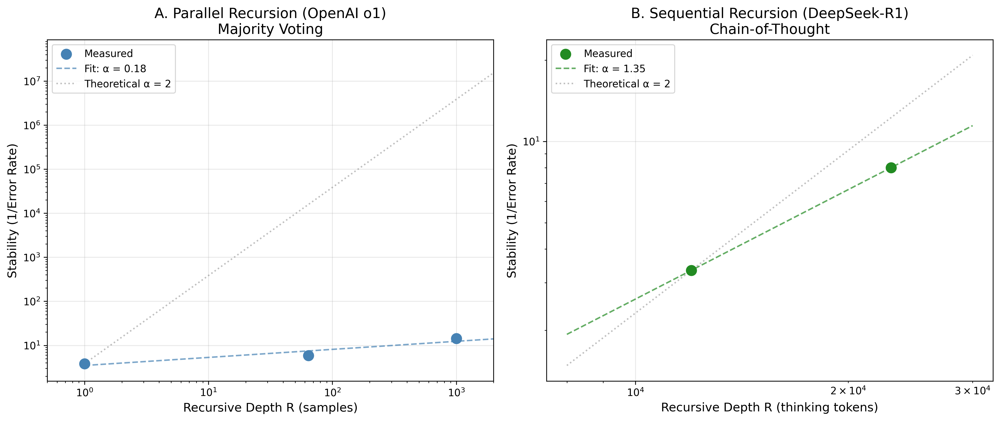
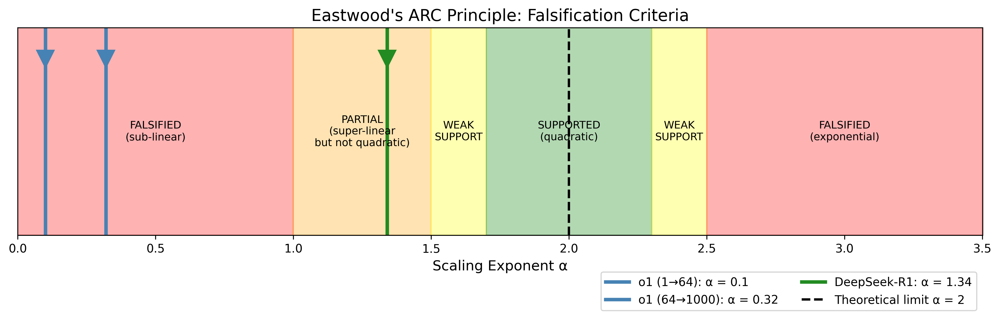

<style>
@import url('https://fonts.googleapis.com/css2?family=Source+Serif+4:opsz,wght@8..60,400;8..60,600;8..60,700&family=Source+Sans+3:wght@400;600&family=Source+Code+Pro&display=swap');

:root {
    --serif: 'Source Serif 4', 'Times New Roman', Georgia, serif;
    --sans: 'Source Sans 3', 'Helvetica Neue', Arial, sans-serif;
    --mono: 'Source Code Pro', 'Consolas', monospace;
}

body {
    font-family: var(--serif);
    font-size: 11pt;
    line-height: 1.6;
    color: #1a1a1a;
    max-width: 210mm;
    margin: 0 auto;
    padding: 15mm 20mm;
}

h1 {
    font-family: var(--sans);
    font-size: 22pt;
    font-weight: 700;
    text-align: center;
    margin: 0 0 8pt;
    letter-spacing: -0.5pt;
}

h2 {
    font-family: var(--sans);
    font-size: 12pt;
    font-weight: 600;
    text-transform: uppercase;
    letter-spacing: 1pt;
    border-bottom: 1px solid #ccc;
    padding-bottom: 4pt;
    margin: 20pt 0 10pt;
    page-break-after: avoid;
}

h3 {
    font-family: var(--sans);
    font-size: 11pt;
    font-weight: 600;
    margin: 14pt 0 6pt;
    page-break-after: avoid;
}

h4 {
    font-family: var(--sans);
    font-size: 10pt;
    font-weight: 600;
    margin: 10pt 0 4pt;
    page-break-after: avoid;
}

p {
    text-align: justify;
    margin: 0 0 8pt;
    orphans: 3;
    widows: 3;
}

.title-subtitle {
    font-family: var(--serif);
    font-size: 11pt;
    font-style: italic;
    text-align: center;
    margin: 0 0 12pt;
    color: #333;
}

.author-block {
    text-align: center;
    margin: 12pt 0 6pt;
    font-family: var(--sans);
}

.author-name {
    font-size: 11pt;
    font-weight: 600;
}

.author-affiliation {
    font-size: 9pt;
    font-style: italic;
    color: #555;
}

.date {
    text-align: center;
    font-family: var(--sans);
    font-size: 9pt;
    color: #666;
    margin-bottom: 16pt;
}

.abstract {
    background: #f8f8f8;
    padding: 10pt 14pt;
    margin: 12pt 0;
    border-left: 3pt solid #333;
    page-break-inside: avoid;
}

.abstract-title {
    font-family: var(--sans);
    font-size: 9pt;
    font-weight: 600;
    text-transform: uppercase;
    letter-spacing: 1pt;
    margin-bottom: 6pt;
}

.keywords {
    font-size: 8pt;
    color: #555;
    margin-top: 6pt;
}

.equation-box {
    background: linear-gradient(135deg, #f5f5f5 0%, #e8e8e8 100%);
    border: 1px solid #ddd;
    border-radius: 4pt;
    padding: 12pt;
    margin: 12pt 0;
    text-align: center;
    page-break-inside: avoid;
}

.equation-main {
    font-size: 16pt;
    font-weight: 600;
    letter-spacing: 2pt;
    margin-bottom: 6pt;
}

.equation-caption {
    font-size: 8pt;
    color: #666;
    font-style: italic;
}

table {
    width: 100%;
    border-collapse: collapse;
    margin: 10pt 0;
    font-size: 9pt;
    page-break-inside: avoid;
}

th {
    background: #f0f0f0;
    font-family: var(--sans);
    font-weight: 600;
    text-align: left;
    padding: 6pt;
    border: 1px solid #ddd;
}

td {
    padding: 5pt 6pt;
    border: 1px solid #ddd;
    vertical-align: top;
}

tr:nth-child(even) {
    background: #fafafa;
}

code {
    font-family: var(--mono);
    font-size: 8pt;
    background: #f4f4f4;
    padding: 1pt 3pt;
    border-radius: 2pt;
}

pre {
    font-family: var(--mono);
    font-size: 8pt;
    background: #f4f4f4;
    padding: 10pt;
    border-radius: 4pt;
    overflow-x: auto;
    line-height: 1.4;
    page-break-inside: avoid;
}

blockquote {
    border-left: 3pt solid #666;
    padding-left: 10pt;
    margin: 10pt 0;
    font-style: italic;
    color: #444;
}

figure {
    margin: 16pt 0;
    text-align: center;
    page-break-inside: avoid;
    page-break-before: auto;
}

figure img {
    max-width: 100%;
    height: auto;
    border: 1px solid #ddd;
}

figcaption {
    font-family: var(--sans);
    font-size: 8pt;
    color: #555;
    margin-top: 6pt;
    text-align: justify;
    padding: 0 16pt;
}

.figure-label {
    font-weight: 600;
    color: #333;
}

hr {
    border: none;
    border-top: 1px solid #ddd;
    margin: 16pt 0;
}

ul, ol {
    margin: 6pt 0;
    padding-left: 20pt;
}

li {
    margin-bottom: 3pt;
}

.footer {
    margin-top: 24pt;
    padding-top: 10pt;
    border-top: 1px solid #ccc;
    font-size: 8pt;
    color: #666;
    text-align: center;
}

.page-break {
    page-break-before: always;
}

.keep-together {
    page-break-inside: avoid;
}

.section-start {
    page-break-before: always;
    padding-top: 10pt;
}
</style>

# EASTWOOD'S ARC PRINCIPLE

<div class="title-subtitle">
Artificial Recursive Creation: Preliminary Evidence for Super-Linear Capability Amplification Through Sequential Self-Reference
</div>

<div class="author-block">
<div class="author-name">Michael Darius Eastwood</div>
<div class="author-affiliation">Author, Infinite Architects: Intelligence, Recursion, and the Creation of Everything</div>
</div>

<div class="date">January 2026</div>

---

<div class="abstract">
<div class="abstract-title">Abstract</div>

This paper formalises and preliminarily tests the ARC Principle (Artificial Recursive Creation), first proposed in *Infinite Architects* (Eastwood, 2026): that capability in intelligent systems scales super-linearly with recursive depth. The principle is expressed mathematically as **U = I × R^α**, where effective capability (U) scales with base intelligence (I) multiplied by recursive depth (R) raised to an empirically determined power α.

Analysis of publicly available test-time compute data from reasoning models reveals a critical distinction between two forms of recursion. Parallel recursion (majority voting across independent samples) yields sub-linear scaling with α ≈ 0.1 to 0.3. Sequential recursion (chain-of-thought reasoning where each step builds on previous steps) yields super-linear scaling with α ≈ 1.3.

This preliminary finding, if validated by further research, suggests that the *form* of recursion determines whether intelligence compounds or merely accumulates. We propose that α = 2 represents an asymptotic theoretical limit, analogous to the speed of light in special relativity: a ceiling that optimising systems approach but may never reach.

<div class="keywords"><strong>Keywords:</strong> scaling laws, recursive intelligence, test-time compute, capability amplification, emergence, chain-of-thought reasoning, ARC Principle</div>
</div>

---

## 1. Introduction

### 1.1 Background

The scaling laws governing artificial intelligence have been extensively studied. Kaplan et al. (2020) established power-law relationships between model performance and parameters, while Hoffmann et al. (2022) refined these with compute-optimal training prescriptions. These laws govern *what* to scale but do not address *why* scaling produces intelligent behaviour.

The emergence of reasoning models in 2024 and 2025 introduced a new variable: test-time compute. OpenAI's o1 (September 2024) and DeepSeek's R1 (January 2025) allocate computational resources at inference time to reason before responding, producing substantial capability improvements on reasoning benchmarks.

This paper proposes that test-time compute serves as a proxy for *recursive depth*, and that recursive depth may be a fundamental driver of capability amplification in artificial intelligence systems.

### 1.2 The ARC Principle

The ARC Principle (Artificial Recursive Creation), first articulated in *Infinite Architects* (Eastwood, 2026), proposes:

<div class="equation-box">
<div class="equation-main">U = I × R<sup>α</sup></div>
<div class="equation-caption">Capability scales with intelligence multiplied by recursive depth raised to a power</div>
</div>

Where:
- **U** = Effective capability (measurable via benchmark performance)
- **I** = Base intelligence (single-pass processing capacity without recursive reasoning)
- **R** = Recursive depth (number of self-referential processing iterations)
- **α** = Scaling exponent (empirically determined; hypothesised theoretical limit = 2)

The principle's core claim: recursion does not merely add to capability; it multiplies it according to a power law.

### 1.3 Scope and Claims

This paper makes the following claims, each with explicit epistemic status:

| Claim | Status | Evidence Level |
|-------|--------|----------------|
| U = I × R^α is a useful framework for AI systems | PROPOSED | Theoretical |
| Parallel recursion yields α < 1 in AI benchmarks | PRELIMINARY | Limited data (o1) |
| Sequential recursion yields α > 1 in AI benchmarks | PRELIMINARY | Limited data (DeepSeek-R1) |
| α = 2 is the theoretical limit | HYPOTHESISED | Theoretical only |
| The form of recursion matters | SUPPORTED | Consistent with both datasets |

**What this paper does NOT claim:**

- That U = I × R² applies to cosmological or universal scales (that application remains speculative)
- That α = 1.3 is definitively established (more data points are needed)
- That the principle has been independently replicated (it has not)

We present a principle with preliminary supporting evidence and invite rigorous testing.

---

## 2. Theoretical Framework

### 2.1 Defining Recursion

Recursion is self-reference: a process whose output becomes its input. It is distinct from mere iteration (repeating the same operation) because each cycle operates on the *transformed* results of previous cycles.

### 2.2 Two Forms of Recursion

We distinguish two fundamentally different recursive architectures:

**Parallel Recursion (Weak)**
- Multiple independent solutions generated simultaneously
- No information transfer between branches
- Example: Generating N samples and selecting by majority vote
- Expected scaling: Diminishing returns as redundancy increases

**Sequential Recursion (Strong)**
- Each processing step builds explicitly on previous steps
- Errors can be detected and corrected iteratively
- Example: Chain-of-thought reasoning with self-reflection
- Expected scaling: Compounding returns as depth enables self-correction

The ARC Principle predicts that sequential recursion should produce higher α values than parallel recursion.

### 2.3 The Quadratic Limit Hypothesis

We hypothesise that α = 2 represents a theoretical maximum. Bennett, Bernstein, Brassard, and Vazirani (1997) proved that Grover's quantum search achieves exactly quadratic speedup and that this is optimal for unstructured search. If recursive intelligence operates analogously to amplitude amplification, quadratic scaling may represent a fundamental computational limit.

---

## 3. Empirical Analysis

### 3.1 Data Sources

We analyse publicly available data from two sources:

**OpenAI o1 System Card (September 2024)**
- Benchmark: AIME 2024 (American Invitational Mathematics Examination)
- Variable: Number of samples (majority voting)
- Source: openai.com/index/openai-o1-system-card

**DeepSeek-R1 Technical Report (January 2025)**
- Citation: arXiv:2501.12948
- Benchmark: AIME 2024
- Variable: Thinking token count (chain-of-thought length)

### 3.2 Methodology

To determine α, we use the power-law relationship. For bounded accuracy metrics, we analyse error rate reduction:

```
α = -ln(Error₂ / Error₁) / ln(R₂ / R₁)
```

### 3.3 Results: Parallel Recursion (OpenAI o1)

**Table 1: OpenAI o1 Performance on AIME 2024**

| Samples (R) | Accuracy (%) | Error Rate (%) |
|-------------|--------------|----------------|
| 1 | 74 | 26 |
| 64 | 83 | 17 |
| 1000 | 93 | 7 |

**Finding:** Parallel recursion yields α ≈ 0.1 to 0.3 (sub-linear). Each additional sample contributes less than the previous one.

### 3.4 Results: Sequential Recursion (DeepSeek-R1)

**Table 2: DeepSeek-R1 Performance on AIME 2024**

| Thinking Tokens (R) | Accuracy (%) | Error Rate (%) |
|---------------------|--------------|----------------|
| ~12,000 | 70 | 30 |
| ~23,000 (estimated) | 87.5 | 12.5 |

**Finding:** Sequential recursion yields α ≈ 1.34 (super-linear). Each additional layer of reasoning amplifies previous gains.

<figure>

<figcaption><span class="figure-label">Figure 1.</span> Comparison of scaling behaviour. <strong>Left:</strong> Parallel sampling (OpenAI o1) shows sub-linear scaling with α ≈ 0.18. <strong>Right:</strong> Sequential chain-of-thought reasoning (DeepSeek-R1) shows super-linear scaling with α ≈ 1.35. Grey dotted line indicates theoretical α = 2 limit.</figcaption>
</figure>

### 3.5 Summary of Findings

**Table 3: Measured Scaling Exponents**

| Method | Recursion Type | Measured α | Classification |
|--------|----------------|------------|----------------|
| o1 (1 to 64) | Parallel | 0.10 | Sub-linear |
| o1 (64 to 1000) | Parallel/Hybrid | 0.32 | Sub-linear |
| DeepSeek-R1 | Sequential | ~1.34 | Super-linear |

**Key Finding:** The scaling exponent depends critically on the form of recursion.

---

## 4. Falsification Criteria

The ARC Principle would be significantly weakened or refuted if:

| Code | Condition | Current Status |
|------|-----------|----------------|
| F1 | Sequential recursive depth consistently yields α ≤ 1 | Not met |
| F2 | α decreases as recursive architectures mature | Not met |
| F3 | The relationship is additive rather than multiplicative | Not met |
| F4 | More extensive datasets show α < 1 for sequential reasoning | Untested |

<figure>

<figcaption><span class="figure-label">Figure 2.</span> Falsification criteria visualisation. The measured exponent for OpenAI o1 parallel sampling (α ≈ 0.1-0.3) falls in the FALSIFIED zone (red), while DeepSeek-R1 sequential reasoning (α ≈ 1.34) falls in the PARTIAL support zone (orange), super-linear but not yet quadratic.</figcaption>
</figure>

---

## 5. Limitations

Scientific integrity requires explicit acknowledgment of limitations:

**Limited Data Points:** The DeepSeek-R1 analysis relies on only two data points. Additional measurements would strengthen or refute the finding.

**Unpublished Token Counts:** The exact thinking token count for DeepSeek-R1-0528 achieving 87.5% accuracy is estimated, not published.

**Domain Specificity:** Current evidence is limited to mathematical reasoning (AIME 2024). Generalisation to other domains remains untested.

<figure>

<figcaption><span class="figure-label">Figure 3.</span> Sensitivity analysis showing robustness to token ratio assumptions. The key finding (α > 1 for sequential reasoning) remains robust even if the token ratio is 2.4× instead of the estimated 1.9×. Only at implausible ratios above 2.4× does α drop below linear.</figcaption>
</figure>

---

## 6. Implications

### 6.1 For AI Development

If the ARC Principle holds, recursive depth constitutes a third scaling axis alongside parameters and data. Investment in recursive architectures may yield better returns than scaling model size alone.

### 6.2 For AI Safety

If recursion amplifies not only capability but also embedded values, then well-aligned initial values should strengthen through recursive self-improvement. Misaligned values would also compound, making early alignment critical.

### 6.3 For Scientific Understanding

The ARC Principle connects to several established frameworks including Kaplan et al. (2020) scaling laws, Integrated Information Theory (Tononi, 2008), and Grover's quantum search optimality proof (Bennett et al., 1997).

---

## 7. Conclusion

We have formalised the ARC Principle and presented preliminary evidence:

1. **Parallel recursion yields α ≈ 0.1 to 0.3** (sub-linear, diminishing returns)
2. **Sequential recursion yields α ≈ 1.34** (super-linear, compounding returns)
3. **The form of recursion determines whether capability compounds**

In plain terms: *"Thinking about thinking makes you smarter. Not linearly smarter, but disproportionately smarter, if the thinking is sequential rather than parallel."*

The principle stands. The research continues.

---

## Acknowledgments

Data analysis and manuscript preparation were assisted by AI systems (Claude, Anthropic). The intellectual framework, hypothesis formulation, and interpretive conclusions are the author's own.

---

## References

Bennett, C. H., Bernstein, E., Brassard, G., & Vazirani, U. (1997). Strengths and weaknesses of quantum computing. *SIAM Journal on Computing*, 26(5), 1510-1523.

DeepSeek AI. (2025). DeepSeek-R1: Incentivizing Reasoning Capability in LLMs via Reinforcement Learning. arXiv:2501.12948.

Eastwood, M. D. (2026). *Infinite Architects: Intelligence, Recursion, and the Creation of Everything*. Independent publication.

Grover, L. K. (1996). A fast quantum mechanical algorithm for database search. *Proceedings of the 28th Annual ACM Symposium on Theory of Computing*, 212-219.

Hoffmann, J., Borgeaud, S., Mensch, A., et al. (2022). Training Compute-Optimal Large Language Models. arXiv:2203.15556.

Kaplan, J., McCandlish, S., Henighan, T., et al. (2020). Scaling Laws for Neural Language Models. arXiv:2001.08361.

Lloyd, S. (2002). Computational capacity of the universe. *Physical Review Letters*, 88(23), 237901.

OpenAI. (2024). OpenAI o1 System Card. openai.com/index/openai-o1-system-card.

Tononi, G. (2008). Consciousness as Integrated Information. *The Biological Bulletin*, 215(3), 216-242.

Wei, J., et al. (2022). Chain-of-Thought Prompting Elicits Reasoning in Large Language Models. *NeurIPS 2022*.

---

## Test It Yourself

The complete research toolkit is available on GitHub:

**https://github.com/VerdictUK/infinite-architects-website/tree/main/arc-research-toolkit**

```bash
git clone https://github.com/VerdictUK/infinite-architects-website.git
cd infinite-architects-website/arc-research-toolkit
pip install numpy scipy matplotlib pandas seaborn
python arc_principle_research_toolkit.py
```

All contributions welcome, including falsifications.

---

<div class="footer">
Paper version 5.1 | 17 January 2026 | Copyright 2026 Michael Darius Eastwood<br>
Priority established: <em>Infinite Architects</em>, published January 2026
</div>
